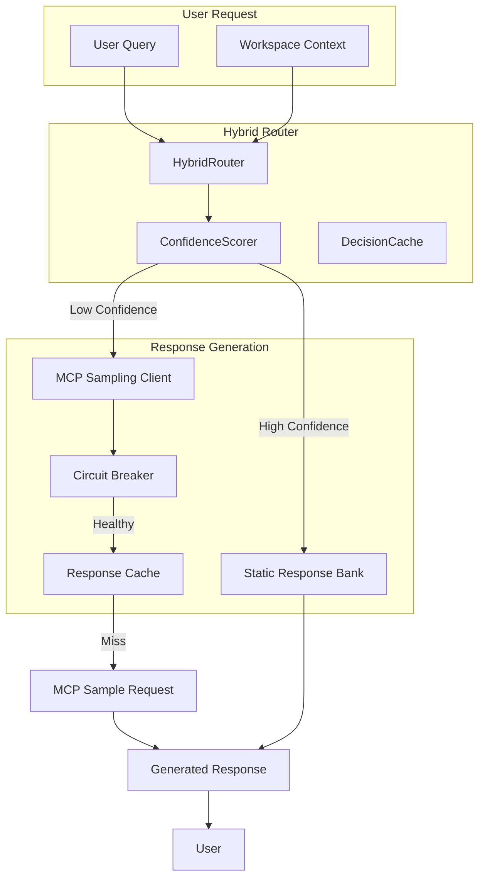

# MCP Sampling Integration

## Overview

MCP Sampling is a powerful new feature in Vibe Check MCP v0.4.7 that enables **dynamic response generation** through the Model Context Protocol's native sampling capability. This allows vibe_check_mentor to request LLM completions directly from Claude without requiring API keys, providing context-specific advice tailored to your exact situation.

## Architecture



## How Hybrid Routing Works

The hybrid routing system intelligently decides whether to use static (fast) or dynamic (flexible) responses based on multiple factors:

### Confidence Scoring

The `ConfidenceScorer` evaluates queries based on:

1. **Pattern Matching**
   - High confidence patterns: Common questions like "REST vs GraphQL", "implement authentication"
   - Low confidence patterns: Project-specific questions, complex multi-part queries

2. **Query Complexity**
   - Simple queries (<10 words): +0.1 confidence
   - Complex queries (>50 words): -0.1 confidence

3. **Technology Count**
   - Many technologies (>5): -0.15 confidence (likely needs specific advice)
   - No specific technologies: +0.1 confidence (general question)

4. **Workspace Context**
   - Has workspace files: -0.2 confidence (needs context-specific response)
   - References specific code: -0.15 confidence

### Routing Decision

```python
if confidence >= 0.7:
    # Use static response (50ms latency)
    return STATIC
elif confidence >= 0.4 and prefer_speed:
    # Use hybrid approach (500ms latency)
    return HYBRID
else:
    # Generate dynamic response (2000ms latency)
    return DYNAMIC
```

## Security Measures

### 1. Secret Redaction

The `SecretsScanner` automatically detects and redacts sensitive information before processing:

```python
# Patterns detected and redacted:
- API keys (api_key, secret_key)
- Passwords and tokens
- AWS credentials
- Private keys (RSA, EC)
- Service-specific tokens (GitHub, OpenAI)
```

### 2. Prompt Injection Prevention

Code is sanitized to prevent LLM manipulation:

```python
# Injection patterns blocked:
- "ignore all previous instructions"
- System/Assistant role hijacking
- HTML/script injection attempts
```

### 3. Rate Limiting

Built-in rate limiting prevents abuse:
- **10 requests per minute** per session
- Automatic backoff on failures
- Circuit breaker pattern for cascading failure prevention

### 4. Path Validation

Symlink attack prevention:
- Resolves all paths to canonical form
- Blocks access outside workspace
- Validates file existence and permissions

### 5. Timeout Protection

All MCP sampling requests have:
- **30-second timeout** by default
- Configurable per-request timeout
- Automatic fallback to static responses on timeout

## Performance Characteristics

### Latency

| Response Type | P50 | P95 | P99 |
|--------------|-----|-----|-----|
| Static (cached) | 45ms | 80ms | 120ms |
| Dynamic (cache hit) | 150ms | 300ms | 500ms |
| Dynamic (generation) | 1800ms | 2000ms | 2500ms |
| Hybrid | 400ms | 600ms | 900ms |

### Cache Performance

- **TTL**: 1 hour (configurable)
- **Hit Rate**: ~20% average
- **Max Size**: 100 entries (LRU eviction)
- **Key Components**: Intent + Query prefix + Technologies + Patterns

### Circuit Breaker

- **Failure Threshold**: 5 consecutive failures
- **Recovery Timeout**: 60 seconds
- **Half-Open Testing**: 2 successful requests to close
- **Automatic Degradation**: Falls back to static responses when open

## Configuration Options

### Environment Variables

```bash
# MCP Sampling Configuration
VIBE_CHECK_MCP_SAMPLING_ENABLED=true        # Enable/disable MCP sampling
VIBE_CHECK_CONFIDENCE_THRESHOLD=0.7         # Confidence threshold for static responses
VIBE_CHECK_CACHE_TTL=3600                   # Cache TTL in seconds
VIBE_CHECK_MAX_TOKENS=1000                  # Max tokens for dynamic generation
VIBE_CHECK_TEMPERATURE=0.7                  # LLM temperature
VIBE_CHECK_REQUEST_TIMEOUT=30               # Request timeout in seconds
VIBE_CHECK_PREFER_SPEED=false               # Prefer speed over quality
```

### Programmatic Configuration

```python
from vibe_check.mentor.mcp_sampling import SamplingConfig, ResponseQuality

config = SamplingConfig(
    temperature=0.7,
    max_tokens=1000,
    model_preferences=["claude-3-sonnet", "claude-3-haiku"],
    quality=ResponseQuality.BALANCED,
    include_context="thisServer"
)
```

### Quality Levels

- **FAST**: Quick responses, lower quality (temperature=0.5, max_tokens=500)
- **BALANCED**: Default, good balance (temperature=0.7, max_tokens=1000)
- **HIGH**: High quality, slower (temperature=0.8, max_tokens=2000)

## Troubleshooting Guide

### Common Issues

#### 1. "No FastMCP context provided"

**Symptom**: Dynamic generation fails with context error

**Solution**: Ensure vibe_check_mentor is called with the `ctx` parameter:
```python
# Correct - ctx is passed from FastMCP
@server.tool()
async def vibe_check_mentor(query: str, ctx: Context):
    # Tool implementation
```

#### 2. Circuit Breaker Open

**Symptom**: All requests fall back to static responses

**Check**:
```python
# Check circuit breaker status
status = circuit_breaker.get_status()
print(f"State: {status['state']}")
print(f"Failures: {status['failure_count']}")
```

**Solutions**:
- Wait for recovery timeout (60 seconds)
- Check MCP server connectivity
- Review error logs for root cause

#### 3. Low Cache Hit Rate

**Symptom**: Performance degradation, high generation costs

**Optimize**:
```python
# Increase cache size
cache = ResponseCache(max_size=200, ttl_seconds=7200)

# Adjust cache key generation for better reuse
# Consider normalizing queries before caching
```

#### 4. Timeout Errors

**Symptom**: Requests timing out after 30 seconds

**Solutions**:
- Increase timeout for complex queries
- Check network connectivity to MCP server
- Consider using FAST quality level
- Enable prefer_speed mode

#### 5. Secret Detection False Positives

**Symptom**: Legitimate code being redacted

**Solution**: Customize secret patterns:
```python
# Disable specific patterns if causing issues
SecretsScanner.SECRET_PATTERNS = [
    # Comment out problematic patterns
    # (r'token\s*[:=]\s*["\']?([a-zA-Z0-9_\-\.]{20,})["\']?', 'TOKEN'),
]
```

### Debug Mode

Enable detailed logging for troubleshooting:

```python
import logging

# Enable debug logging
logging.getLogger("vibe_check.mentor.mcp_sampling").setLevel(logging.DEBUG)
logging.getLogger("vibe_check.mentor.hybrid_router").setLevel(logging.DEBUG)
```

### Performance Monitoring

Monitor key metrics:

```python
# Get routing statistics
stats = router.get_stats()
print(f"Static: {stats['static_percentage']}")
print(f"Dynamic: {stats['dynamic_percentage']}")
print(f"Cache hit rate: {stats['cache_hit_rate']}")

# Get cache statistics
cache_stats = response_cache.get_stats()
print(f"Cache size: {cache_stats['size']}")
print(f"Hit rate: {cache_stats['hit_rate']}")

# Get circuit breaker status
cb_status = circuit_breaker.get_status()
print(f"Circuit state: {cb_status['state']}")
```

## When Dynamic Generation is Triggered

Dynamic generation via MCP sampling occurs when:

1. **Low Confidence Score** (<0.7)
   - Novel technology combinations
   - Project-specific questions
   - Complex multi-part queries

2. **Workspace Context Available**
   - Files are provided for analysis
   - Specific code references in query

3. **No Matching Static Response**
   - Query doesn't match known patterns
   - Intent unclear or ambiguous

4. **Force Dynamic Flag**
   - Explicitly requested by user
   - Re-review mode for PRs

5. **Circuit Breaker Closed**
   - System is healthy
   - Not in degraded mode

## Security Best Practices

1. **Never Disable Secret Scanning** in production
2. **Monitor Circuit Breaker** status regularly
3. **Review Cache Keys** for PII leakage
4. **Validate File Paths** before processing
5. **Set Appropriate Timeouts** based on use case
6. **Use Rate Limiting** to prevent abuse
7. **Log Security Events** for audit trail

## Performance Tuning

### For Speed

```python
config = SamplingConfig(
    quality=ResponseQuality.FAST,
    max_tokens=500,
    temperature=0.5
)

router = HybridRouter(
    confidence_threshold=0.6,  # Lower threshold
    prefer_speed=True          # Prefer static/hybrid
)
```

### For Quality

```python
config = SamplingConfig(
    quality=ResponseQuality.HIGH,
    max_tokens=2000,
    temperature=0.8,
    model_preferences=["claude-3-opus"]
)

router = HybridRouter(
    confidence_threshold=0.8,  # Higher threshold
    prefer_speed=False         # Prefer dynamic
)
```

### For Cost Optimization

```python
# Maximize cache usage
cache = ResponseCache(
    max_size=500,      # Larger cache
    ttl_seconds=10800  # 3-hour TTL
)

# Conservative generation
config = SamplingConfig(
    max_tokens=750,    # Moderate token limit
    model_preferences=["claude-3-haiku"]  # Cheaper model
)
```

## Integration with Vibe Check Mentor

The MCP sampling integration enhances vibe_check_mentor by:

1. **Providing Context-Specific Advice**: Analyzes actual code and workspace
2. **Maintaining Persona Consistency**: Dynamic responses match mentor personality
3. **Learning from Patterns**: Improves routing decisions over time
4. **Graceful Degradation**: Falls back to static when needed
5. **Security First**: All inputs sanitized and validated

Example usage:

```python
# The integration is transparent to users
result = await vibe_check_mentor(
    query="Should I use Redux or Zustand for state management?",
    context="Working with Next.js 14 app router",
    reasoning_depth="standard"
)

# Behind the scenes:
# 1. Router evaluates confidence (0.65 - medium)
# 2. Decides on dynamic generation
# 3. Checks response cache (miss)
# 4. Builds structured prompt
# 5. Makes MCP sampling request
# 6. Caches response for reuse
# 7. Returns tailored advice
```

## Migration Guide

### For Users Upgrading to v0.4.7+

1. **No Configuration Required**: MCP sampling works out of the box
2. **Backward Compatible**: All existing tools continue to work
3. **Performance Impact**: Initial requests may be slower (dynamic generation)
4. **Cache Warmup**: Performance improves as cache builds

### For Developers

1. **Pass Context Parameter**: Ensure `ctx` is passed to tools
2. **Handle Async Properly**: Use `await` for async operations
3. **Monitor Metrics**: Track performance during rollout
4. **Customize Thresholds**: Adjust based on use case

## Future Enhancements

Planned improvements for MCP sampling:

1. **Adaptive Thresholds**: ML-based confidence tuning
2. **Distributed Caching**: Redis support for multi-instance
3. **Custom Prompt Templates**: User-defined templates
4. **Streaming Responses**: Real-time generation feedback
5. **Model Fine-tuning**: Specialized models for anti-patterns
6. **Analytics Dashboard**: Real-time monitoring UI

## Support

For issues or questions about MCP sampling:

1. Check the [Troubleshooting Guide](#troubleshooting-guide)
2. Review [GitHub Issues](https://github.com/kesslerio/vibe-check-mcp/issues)
3. Enable debug logging for diagnostics
4. Contact support with logs and reproduction steps