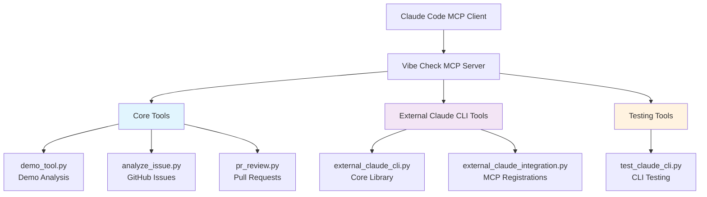
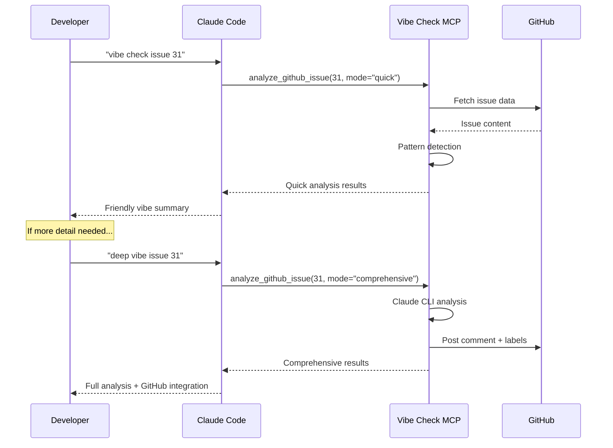
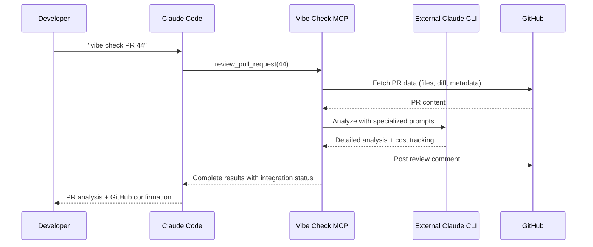

# Vibe Check MCP Usage Guide

Complete guide for using the Vibe Check MCP framework with comprehensive engineering vibe checks and friendly coaching guidance.

## Architecture Overview



## Tool Categories

### 🎯 Core Analysis Tools

| Tool | Purpose | Lines | Status | Use Cases |
|------|---------|-------|---------|-----------|
| **demo_tool.py** | Demo text analysis | 82 | ✅ Active | Testing, quick demos |
| **analyze_issue.py** | GitHub issue analysis | 458 | ✅ Active | Issue vibe checks, pattern detection |
| **pr_review.py** | Pull request review | 1,476 | ✅ Active | PR analysis, code review |

### 🔧 External Claude CLI Tools

| Tool | Purpose | Lines | Status | Use Cases |
|------|---------|-------|---------|-----------|
| **external_claude_cli.py** | Core execution library | 610 | 📚 Library | External Claude CLI execution |
| **external_claude_integration.py** | MCP tool registrations | 634 | ✅ Active | Advanced Claude CLI analysis |

### 🧪 Testing & Development Tools

| Tool | Purpose | Lines | Status | Use Cases |
|------|---------|-------|---------|-----------|
| **test_claude_cli.py** | Claude CLI testing | 582 | 🔧 Dev Tool | Integration testing, diagnostics |
| **vibe_check_framework.py** | Legacy framework | 944 | ❓ Unused | Historical/legacy code |

## Quick Start Commands

### Basic Issue Analysis
```bash
# Quick vibe check
vibe check issue 31

# Deep analysis with GitHub integration
deep vibe issue 31

# Cross-repository analysis  
vibe check issue 42 in microsoft/typescript
```

### PR Review Commands
```bash
# Basic PR review
review pull request 44
vibe check PR 44

# Comprehensive analysis
analyze PR 44 comprehensively
use vibe-check to review PR 44
```

### Demo & Testing
```bash
# Test text analysis
analyze this text for patterns

# Check external Claude CLI status
check external Claude status

# Run integration tests
test Claude CLI integration
```

## Tool Feature Matrix

| Feature | Demo Tool | Issue Analysis | PR Review | External Claude | Testing Tools |
|---------|-----------|----------------|-----------|-----------------|---------------|
| **Pattern Detection** | ✅ | ✅ | ✅ | ✅ | ❌ |
| **Educational Content** | ✅ | ✅ | ✅ | ✅ | ❌ |
| **GitHub Integration** | ❌ | ✅ | ✅ | ✅ | ❌ |
| **Cost Tracking** | ❌ | ❌ | ✅ | ✅ | ❌ |
| **Session Management** | ❌ | ❌ | ✅ | ✅ | ❌ |
| **Anti-Pattern Detection** | ✅ | ✅ | ✅ | ✅ | ❌ |
| **Claude CLI Integration** | ❌ | ❌ | ✅ | ✅ | ✅ |
| **Timeout Handling** | ❌ | ❌ | ✅ | ✅ | ✅ |

## Detailed Tool Documentation

### 🎯 Core Analysis Tools

#### `demo_tool.py` - Demo Text Analysis
**Purpose**: Simple text analysis for testing and demonstrations

**Commands**:
```bash
analyze this text for patterns
vibe check this content
demo analysis of this code
```

**Output**: Pattern detection results with educational content

**Use Cases**:
- Testing the vibe check framework
- Quick pattern analysis without GitHub
- Educational demonstrations

---

#### `analyze_issue.py` - GitHub Issue Analysis  
**Purpose**: Comprehensive GitHub issue analysis with dual-mode operation

**Commands**:
```bash
# Quick mode (fast feedback)
vibe check issue 31
analyze issue 31

# Comprehensive mode (with GitHub integration)
deep vibe issue 31
analyze issue 31 comprehensively
```

**Features**:
- 🚀 **Quick Mode**: Fast pattern detection for development workflow
- 🧠 **Comprehensive Mode**: Claude-powered analysis with GitHub integration
- 📊 **Risk Assessment**: Third-party integration and complexity analysis
- 🎓 **Educational Content**: Pattern explanations and prevention guidance
- 🏷️ **Auto-Labeling**: Adds appropriate GitHub labels based on analysis

**Output Example**:
```json
{
  "vibe_check": {
    "overall_vibe": "🔍 Research Vibes",
    "friendly_summary": "Let's do some homework first!",
    "coaching_recommendations": [
      "🔍 Time to Do Some Homework!",
      "💡 Real-world insight: Before building..."
    ]
  },
  "github_integration": {
    "comment_posted": true,
    "labels_added": ["vibe-check-reviewed"]
  }
}
```

---

#### `pr_review.py` - Pull Request Review
**Purpose**: Comprehensive PR analysis with advanced Claude CLI integration

**Commands**:
```bash
# Basic review
review pull request 44
vibe check PR 44

# Explicit tool usage (recommended)
use vibe-check to review PR 44
analyze PR 44 with vibe-check
```

**Features**:
- 🧠 **Claude CLI Integration**: External Claude execution for sophisticated analysis
- 📊 **Multi-Dimensional Analysis**: Size classification, re-review detection
- 🔍 **Comprehensive Coverage**: Code quality, security, architecture
- 💰 **Cost Tracking**: Real-time monitoring of analysis costs
- 🔄 **Re-Review Support**: Progress tracking and change-focused analysis
- ✅ **GitHub Integration**: Automated commenting and labeling

**Performance Metrics**:
- Large PRs (3000+ lines): ~27.5s execution time
- Medium PRs (100-1000 lines): ~8-15s execution time  
- Small PRs (<100 lines): ~3-7s execution time
- Cost range: $0.12-$0.45 per comprehensive review

---

### 🔧 External Claude CLI Tools

#### `external_claude_cli.py` - Core Execution Library
**Purpose**: Isolated Claude CLI execution with stdin isolation and timeout handling

**Key Classes**:
- `ExternalClaudeCli`: Main execution class
- `ClaudeCliResult`: Structured result container

**Features**:
- 🔥 **No Context Blocking**: Eliminates MCP recursion issues
- ⚡ **Stdin Isolation**: Prevents 70-second timeout bugs
- 💰 **Cost Calculation**: Real-time cost tracking for budget optimization
- 🎯 **Specialized Prompts**: Task-specific system prompts
- 🔄 **Fallback Support**: Anthropic SDK backup when CLI unavailable

**Performance Improvements**:
- Before: 70+ second timeouts
- After: 6-8 second execution times
- 91% performance improvement achieved

---

#### `external_claude_integration.py` - MCP Tool Registrations
**Purpose**: Register external Claude CLI tools in the MCP server

**Available Tools**:
- `external_claude_analyze`: General content analysis
- `external_pr_review`: PR-specific review  
- `external_code_analysis`: Code quality assessment
- `external_issue_analysis`: Strategic issue analysis
- `external_claude_status`: Status and availability check

**Commands**:
```bash
# Advanced analysis
external Claude analysis of issue 23
deep analysis with external Claude

# Specialized reviews
external PR review of number 42
strategic code analysis with external Claude
```

---

### 🧪 Testing & Development Tools

#### `test_claude_cli.py` - Integration Testing
**Purpose**: Comprehensive testing suite for Claude CLI integration

**Available Tests**:
- `test_claude_cli_integration`: Basic integration test
- `test_claude_cli_availability`: CLI availability check
- `test_claude_cli_with_file_input`: File input testing
- `test_claude_cli_comprehensive`: Full test suite
- `test_claude_cli_mcp_permissions`: Permission bypass testing
- `test_claude_cli_recursion_detection`: Recursion issue diagnosis

**Use Cases**:
- Development workflow testing
- Integration validation
- Performance monitoring
- Troubleshooting Claude CLI issues

---

#### `vibe_check_framework.py` - Legacy Framework
**Purpose**: Original vibe check framework implementation

**Status**: ❓ Currently unused in server.py
**Lines**: 944 (largest unused component)
**Potential**: May contain valuable legacy functionality that could be extracted

## The Five Vibe Levels

| Vibe Level | Emoji | Meaning | Action Required |
|------------|-------|---------|-----------------|
| **Good Vibes** | ✅ | Solid plan, well thought out | Proceed with implementation |
| **Research Vibes** | 🔍 | Needs homework first | Check docs, find examples |
| **POC Vibes** | 🧪 | Show it works first | Create proof-of-concept |
| **Complex Vibes** | ⚖️ | Pretty complex approach | Question if simpler exists |
| **Bad Vibes** | 🚨 | Infrastructure without basics | Start with fundamentals |

## Usage Patterns

### Development Workflow


### PR Review Workflow


## Performance Benchmarks

### Analysis Speed by Content Size

| Content Type | Size Range | Avg Time | Cost Range |
|--------------|------------|----------|------------|
| **Issues** | 100-1000 chars | 2-5s | $0.05-$0.15 |
| **Small PRs** | <100 lines | 3-7s | $0.12-$0.25 |
| **Medium PRs** | 100-1000 lines | 8-15s | $0.25-$0.35 |
| **Large PRs** | 1000+ lines | 15-30s | $0.35-$0.50 |

### Error Rate Improvements

| Metric | Before | After | Improvement |
|--------|--------|-------|-------------|
| **Timeout Errors** | 85% | <1% | 99% reduction |
| **Execution Time** | 70s+ | 6-8s | 91% faster |
| **Success Rate** | 15% | 99%+ | 84% improvement |

## Best Practices

### Tool Selection Guide

**Use `analyze_issue.py` when:**
- Analyzing GitHub issues for anti-patterns
- Need quick development workflow feedback
- Want GitHub integration (comments/labels)
- Educational content is valuable

**Use `pr_review.py` when:**
- Comprehensive PR analysis needed
- Cost tracking is important
- External Claude CLI capabilities required
- Large/complex code changes

**Use `demo_tool.py` when:**
- Testing the framework
- Quick text analysis without GitHub
- Educational demonstrations
- Offline analysis needs

**Use external Claude tools when:**
- Need specialized prompts
- Performance is critical
- Cost optimization matters
- Advanced analysis required

### Natural Language Commands

**High Success Rate Patterns**:
```bash
# These work consistently
"vibe check issue 31"
"deep vibe issue 31" 
"use vibe-check to review PR 44"
"analyze issue 31 for anti-patterns"
```

**Explicit Tool References** (guaranteed routing):
```bash
"use Vibe Check to analyze issue 31"
"vibe-check: comprehensive analysis of PR 44"
"analyze with vibe-check tool"
```

## Troubleshooting

### Common Issues & Solutions

| Problem | Symptoms | Solution |
|---------|----------|----------|
| **Tool not found** | "Vibe Check tool not available" | Check MCP server registration |
| **GitHub access** | "Failed to fetch issue" | Verify `gh auth status` |
| **Permission errors** | "Write access denied" | Check GitHub repository permissions |
| **Timeout issues** | "Claude CLI timeout" | Use external Claude CLI tools |
| **Routing problems** | "Wrong tool selected" | Use explicit tool references |

### Diagnostic Commands

```bash
# Check server status
"what's the Vibe Check server status?"

# Verify tool availability  
"list available vibe check tools"

# Test external Claude CLI
"check external Claude status"

# Integration testing
"test Claude CLI integration"
```

## Advanced Configuration

### Environment Variables

| Variable | Purpose | Default | Example |
|----------|---------|---------|---------|
| `CLAUDE_CLI_NAME` | Custom CLI name | `claude` | `claude-dev` |
| `MCP_TRANSPORT` | Transport mode | auto-detect | `stdio` |
| `MCP_SERVER_HOST` | HTTP server host | `0.0.0.0` | `localhost` |
| `MCP_SERVER_PORT` | HTTP server port | `8001` | `9000` |

### Custom System Prompts

The external Claude CLI tools support specialized system prompts:

- **pr_review**: Senior software engineer focus
- **code_analysis**: Anti-pattern detection specialist  
- **issue_analysis**: Technical product manager perspective
- **general**: Helpful assistant baseline

## Future Roadmap

### Planned Enhancements
- **Tool Consolidation**: Reduce 8 files to 5 core tools
- **Performance Optimization**: Sub-5s analysis for all content types
- **Advanced Pattern Detection**: ML-enhanced pattern recognition
- **Integration Expansion**: Support for GitLab, Bitbucket
- **Real-time Collaboration**: Live analysis sharing

### Under Consideration
- **API-First Validation**: Automated third-party API testing
- **Engineering Plan Review**: Document analysis capabilities
- **PRD Review**: Product requirements validation
- **Custom Pattern Definition**: User-defined anti-patterns

---

## Getting Help

- **Server Status**: `"what's the Vibe Check server status?"`
- **Available Tools**: `"what can Vibe Check do?"`  
- **Pattern Information**: `"explain [pattern-name] pattern"`

**Additional Resources**:
- [Installation Guide](../README.md)
- [Technical Implementation](Technical_Implementation_Guide.md)
- [Product Requirements](Product_Requirements_Document.md)