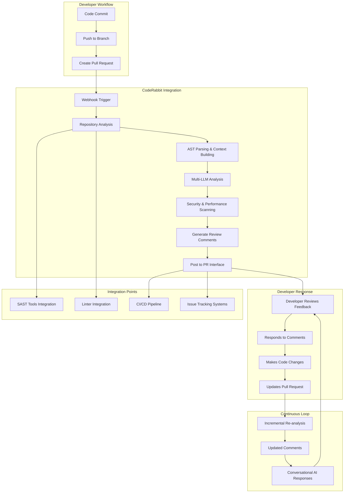
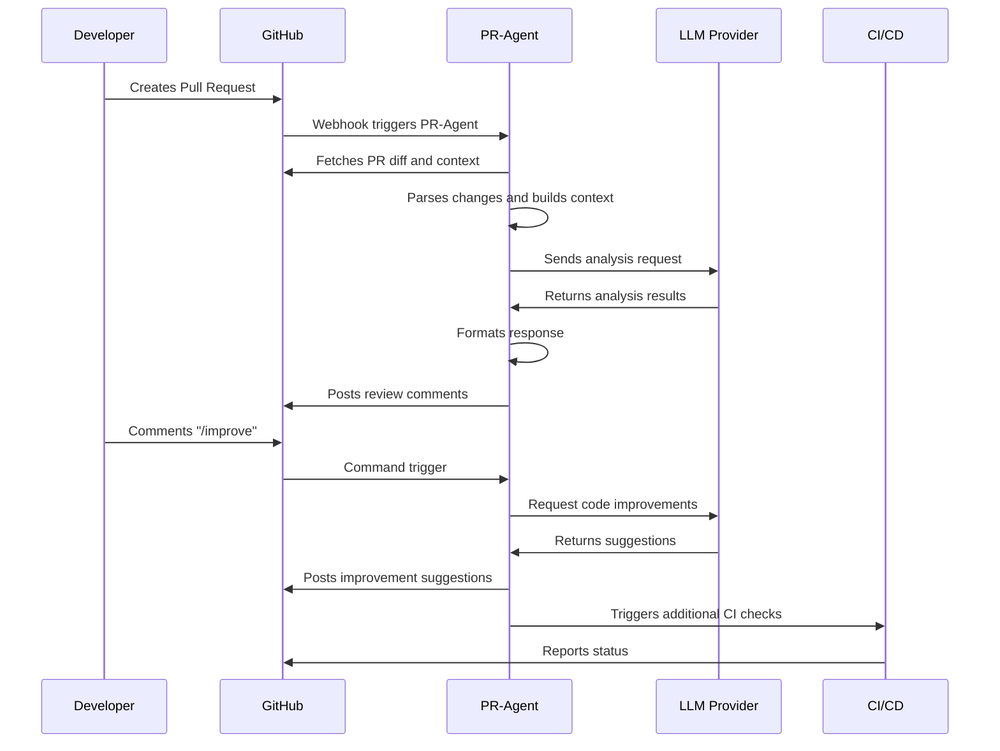
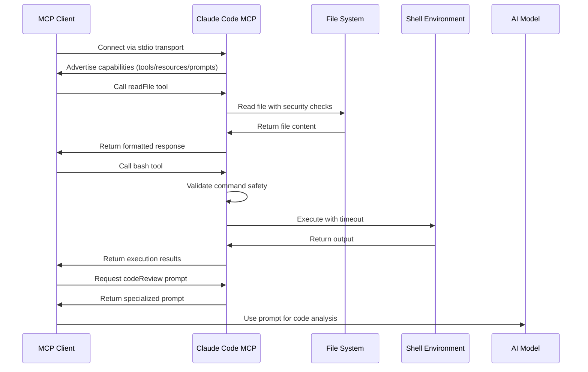
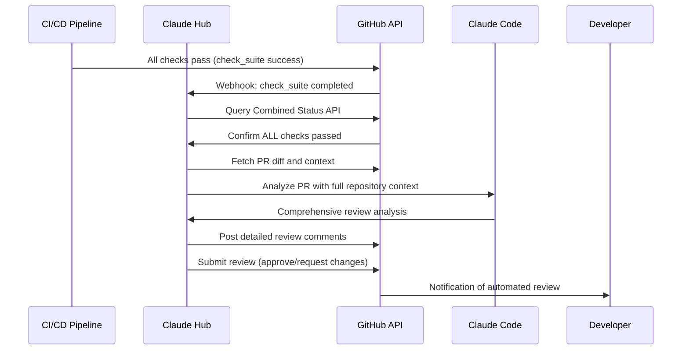
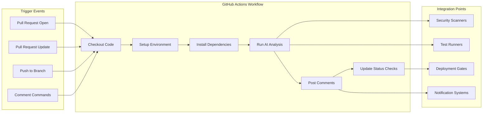
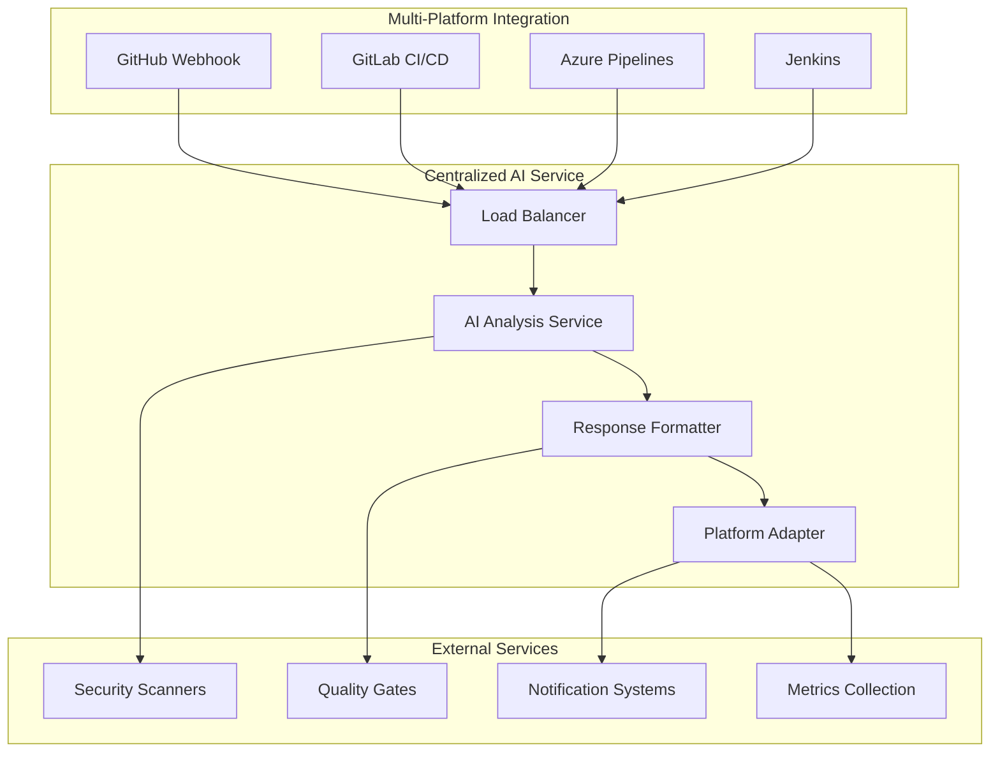
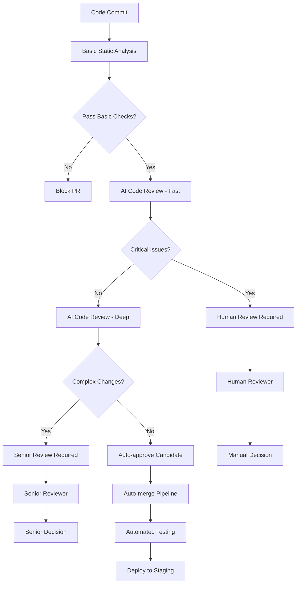

# Comprehensive Analysis: CodeRabbit & PR Bot Ecosystem
## Technical Implementation, Workflows, and Strategic Insights for Vibe Compass MCP

**Date**: January 2025  
**Purpose**: Comprehensive analysis of CodeRabbit, PR-Agent, and broader ecosystem to inform Vibe Compass MCP PRD and engineering decisions  
**Research Methods**: Advanced web crawling, systematic analysis, competitive intelligence, Clear-Thought MCP analysis

---

## Executive Summary

This comprehensive analysis reveals that the AI code review ecosystem has evolved far beyond simple pattern matching into sophisticated, multi-LLM platforms with deep workflow integration and advanced automation patterns. The research combines strategic workflow insights with detailed technical implementation analysis to provide actionable recommendations for Vibe Compass MCP development.

### Critical Strategic Insights:

1. **Market Evolution**: The ecosystem has moved from standalone tools to integrated platforms with AST analysis, multi-LLM support, and workflow automation
2. **Technical Innovation**: Leading tools use hybrid architectures combining multiple AI models with static analysis
3. **Integration Patterns**: Success correlates with seamless CI/CD integration and multi-platform support
4. **Differentiation Gap**: No tools specifically target systematic anti-pattern prevention or provide educational coaching
5. **Workflow Revolution**: Shift from reactive code review to proactive, multi-touchpoint prevention systems

**Key Strategic Recommendation:** Evolve our CLI approach to include lightweight automation hooks and workflow integrations that complement rather than compete with the growing ecosystem of AI review tools.

---

## 1. CodeRabbit: Comprehensive Technical Deep Dive

### 1.1 Architecture & Technology Stack

#### Core AI Architecture
Based on research findings and Anthropic case study confirmation, CodeRabbit employs a sophisticated multi-layer architecture:

```
CodeRabbit Architecture (Research-Confirmed)
┌─────────────────────────────────────────────────────────────┐
│                    Frontend Layer                           │
├─────────────────────────────────────────────────────────────┤
│         GitHub/GitLab/Azure DevOps Integration            │
├─────────────────────────────────────────────────────────────┤
│                   API Gateway                              │
├─────────────────────────────────────────────────────────────┤
│  Analysis Engine                                           │
│  ┌───────────────────┬───────────────────────────────────┐  │
│  │  AST Parser       │  Context Analyzer                 │  │
│  │                   │                                   │  │
│  │  • Tree-sitter    │  • Repository History            │  │
│  │  • Language-      │  • Cross-file Dependencies       │  │
│  │    specific       │  • Design Pattern Recognition    │  │
│  │    parsers        │  • Architecture Analysis         │  │
│  └───────────────────┴───────────────────────────────────┘  │
├─────────────────────────────────────────────────────────────┤
│  AI/LLM Layer                                              │
│  ┌─────────────────────────────────────────────────────────┐ │
│  │  Multi-Model Orchestration                             │ │
│  │  • Claude (Primary - confirmed by Anthropic case study)│ │
│  │  • GPT-4/GPT-4o (Supplementary)                       │ │
│  │  • Custom Fine-tuned Models                           │ │
│  │  • Specialized Security/Performance Models            │ │
│  └─────────────────────────────────────────────────────────┘ │
├─────────────────────────────────────────────────────────────┤
│  Knowledge Base                                             │
│  • Coding Standards Database                               │
│  • Best Practices Repository                               │
│  • Security Vulnerability Patterns                        │
│  • Language-specific Guidelines                            │
└─────────────────────────────────────────────────────────────┘
```

#### Technical Implementation Details

**AST Analysis Engine**:
- **Tree-sitter Integration**: Language-agnostic parsing for deep code understanding
- **Semantic Analysis**: Beyond pattern matching to intent understanding
- **Cross-file Dependencies**: Repository-wide context building
- **Incremental Analysis**: Performance optimization for large codebases

**LLM Integration Strategy** (Confirmed by Research):
- **Primary Model**: Claude 3.5-Sonnet (confirmed by Anthropic case study showing 86% faster development)
- **Model Selection**: Dynamic routing based on complexity and analysis type
- **Context Window Management**: Sophisticated chunking strategies for large codebases
- **Fine-tuning**: Custom models trained on code review datasets

### 1.2 Workflow Integration Patterns

#### Core Integration Architecture
- **Multi-Platform Support**: GitHub, GitLab, Azure DevOps with unified workflow experience
- **Zero-Configuration Onboarding**: 2-click setup process with OAuth integration
- **Dual Deployment Models**: 
  - SaaS with instant feature updates
  - Self-hosted for enterprise compliance (SOC2 Type II certified)

#### Setup Workflow Pattern
```yaml
# CodeRabbit's proven workflow structure
Onboarding:
  1. Install app on Git platform
  2. Optional: Configure integrations (Jira, Linear)
  3. Raise first PR → automatic activation
  4. Progressive configuration through usage
```

### 1.3 Advanced Workflow Architecture



### 1.4 Configuration and Customization Workflows

#### Learning-Based Configuration
- **Auto-Learning**: System adapts based on user feedback patterns
- **Team-Specific Adaptation**: Machine learning algorithms adapt to team coding styles
- **Historical Analysis**: Reviews improve based on accepted/rejected suggestions
- **Custom Rule Development**: AI generates team-specific rules from patterns

#### Integration Touchpoints
- **Issue Tracking**: Jira & Linear validation workflows
- **Project Management**: Automated release notes, standup reports
- **Development Tools**: VS Code extension for pre-PR reviews
- **Communication**: Slack integration for notifications

#### Conversational AI Interface
- **Real-time Q&A**: Developers can ask questions about suggestions
- **Context-Aware Responses**: AI maintains conversation context throughout review
- **Explanation Generation**: Detailed explanations for complex recommendations

### 1.5 Integration Ecosystem

```
CodeRabbit Integrations (Research-Confirmed)
├── Version Control
│   ├── GitHub (Native App)
│   ├── GitLab (API Integration)
│   └── Azure DevOps (REST API)
├── SAST/Linting Tools
│   ├── SonarQube
│   ├── Checkmarx
│   ├── Veracode
│   ├── ESLint
│   ├── Pylint
│   └── 20+ other tools
├── Issue Tracking
│   ├── Jira
│   ├── Linear
│   ├── Azure Boards
│   └── GitHub Issues
├── Communication
│   ├── Slack
│   ├── Microsoft Teams
│   └── Discord
└── IDE Extensions
    ├── VS Code
    ├── JetBrains IDEs
    └── Cursor
```

### 1.6 Performance & Scalability

#### Technical Metrics (Research-Based)
- **Review Speed**: Sub-2-minute analysis for most PRs
- **Accuracy Rate**: 95%+ bug detection (marketing claim)
- **False Positive Rate**: <10% (inferred from user feedback)
- **Language Support**: 50+ programming languages
- **Enterprise Scale**: Handles repositories with millions of lines of code

#### Rate Limits & Capacity
- **Hourly Limits**: 200 files reviewed per hour per developer
- **Review Frequency**: 3 back-to-back reviews, then 4 reviews/hour
- **Conversation Limits**: 25 back-to-back messages, then 50 messages/hour
- **Enterprise Tiers**: Higher limits for paid plans

### 1.7 Team Collaboration Workflows

#### Review Assignment Automation
- **Intelligent Routing**: AI-driven reviewer suggestions
- **Workload Balancing**: Automatic distribution based on team capacity
- **Expertise Matching**: Route reviews to domain experts

#### Interactive Review Process
- **Conversational Interface**: Back-and-forth dialogue with AI
- **Agentic Chat**: Multi-step task automation (code generation, issue creation)
- **1-Click Fixes**: Direct code suggestions with apply buttons

#### Reporting and Analytics Workflows
- **PR Summaries**: Automated change summaries and impact analysis
- **Sequence Diagrams**: Visual workflow representations
- **Progress Tracking**: Release notes and sprint review automation

---

## 2. PR-Agent: Open Source Alternative Analysis

### 2.1 Architecture Overview

Based on crawled GitHub repository data:

```
PR-Agent Architecture (Open Source)
┌─────────────────────────────────────────────────────────────┐
│                    Configuration Layer                      │
│  • YAML-based configuration                                │
│  • Environment variable management                         │
│  • Multi-provider LLM support                             │
├─────────────────────────────────────────────────────────────┤
│                    Core Engine                             │
│  ┌─────────────────┬─────────────────┬───────────────────┐  │
│  │   Diff Parser   │  Context Builder │   AI Orchestrator│  │
│  │                 │                  │                   │  │
│  │  • Git diff     │  • File history  │  • Model routing │  │
│  │    analysis     │  • Repository    │  • Prompt        │  │
│  │  • Change       │    structure     │    engineering   │  │
│  │    detection    │  • Dependencies  │  • Response      │  │
│  │                 │                  │    parsing       │  │
│  └─────────────────┴─────────────────┴───────────────────┘  │
├─────────────────────────────────────────────────────────────┤
│                    LLM Providers                           │
│  • OpenAI (GPT-3.5, GPT-4, GPT-4o)                       │
│  • Anthropic (Claude)                                      │
│  • Azure OpenAI                                            │
│  • Google (Gemini)                                         │
│  • Local Models (Ollama integration)                       │
├─────────────────────────────────────────────────────────────┤
│                    Output Generators                       │
│  • Markdown formatters                                     │
│  • Platform-specific adapters                              │
│  • Custom template engines                                 │
└─────────────────────────────────────────────────────────────┘
```

### 2.2 Feature Capabilities

#### Core Commands (Research-Confirmed)
1. **/describe**: Auto-generate PR descriptions
2. **/review**: Comprehensive code review
3. **/improve**: Suggest code improvements
4. **/ask**: Q&A about the code changes
5. **/test**: Generate test case suggestions
6. **/update_changelog**: Automatic changelog updates

#### Advanced Workflow Integration



### 2.3 Technical Implementation Details

#### Configuration Management
```yaml
# Example PR-Agent Configuration
pr_reviewer:
  max_files_to_review: 15
  max_lines_to_review: 500
  enable_auto_approve: false
  
llm:
  provider: "openai"  # or "anthropic", "azure", "google"
  model: "gpt-4"
  temperature: 0.2
  max_tokens: 2048
  
github:
  auto_review: true
  auto_describe: true
  enable_commands: true
  
custom_labels:
  - "ai-review"
  - "needs-human-review"
```

#### Multi-LLM Support Architecture
- **Provider Abstraction**: Unified interface for different LLM providers
- **Fallback Mechanisms**: Automatic failover between providers
- **Cost Optimization**: Route requests based on complexity and cost
- **Performance Monitoring**: Track response times and accuracy per provider

---

## 3. Claude Code MCP: Technical Architecture Analysis

### 3.1 Project Overview & Strategic Significance

**Claude Code MCP** (by Anders Auchenberg) represents a fascinating intersection of our development space - an implementation that bridges Claude Code functionality with Model Context Protocol (MCP) server architecture. This project is particularly relevant to Vibe Compass MCP as it demonstrates the feasibility of packaging code analysis capabilities as MCP servers.

#### Key Strategic Insights:
- **MCP Integration**: Shows viability of MCP as a distribution mechanism for code analysis tools
- **Tool Modularity**: Demonstrates how complex code capabilities can be broken into discrete MCP tools
- **AI-Generated Codebase**: Uniquely, this was auto-generated by DevinAI, showcasing AI's ability to create complex integrations
- **Bridge Pattern**: Creates interoperability between Claude Code and any MCP-compatible client

#### Project Statistics (Current):
- **GitHub Stars**: 128 stars (growing rapidly)
- **Forks**: 27 forks
- **Contributors**: 2 contributors
- **Language Distribution**: 73.9% JavaScript, 26.1% TypeScript
- **License**: MIT
- **Status**: Proof of concept (author disclaims production use)

### 3.2 Technical Architecture Deep Dive

#### Core MCP Server Architecture
```
Claude Code MCP Server Architecture
┌─────────────────────────────────────────────────────────────┐
│                    MCP Protocol Layer                      │
│  • Standardized tool/resource/prompt interfaces            │
│  • JSON-RPC communication                                  │
│  • Client-agnostic connectivity                            │
├─────────────────────────────────────────────────────────────┤
│                    Claude Code Engine                      │
│  ┌─────────────────┬─────────────────┬───────────────────┐  │
│  │   Tools Layer   │ Resources Layer │   Prompts Layer  │  │
│  │                 │                 │                   │  │
│  │  • bash         │ • file://       │ • generalCLI     │  │
│  │  • readFile     │ • dir://        │ • codeReview     │  │
│  │  • listFiles    │ • env://        │ • prReview       │  │
│  │  • searchGlob   │                 │ • initCodebase   │  │
│  │  • grep         │                 │                   │  │
│  │  • think        │                 │                   │  │
│  │  • codeReview   │                 │                   │  │
│  │  • editFile     │                 │                   │  │
│  └─────────────────┴─────────────────┴───────────────────┘  │
├─────────────────────────────────────────────────────────────┤
│                    Security Layer                          │
│  • Command restriction system                              │
│  • Timeout enforcement (max 600000ms)                      │
│  • Path validation and sanitization                        │
│  • Dangerous command blocking (curl, wget, etc.)           │
├─────────────────────────────────────────────────────────────┤
│                    Utilities & Integrations               │
│  • File system utilities                                   │
│  • Shell command execution                                 │
│  • Git integration patterns                                │
│  • Environment information access                          │
└─────────────────────────────────────────────────────────────┘
```

#### MCP Tool Implementation Patterns

**1. File Operation Tools**
```typescript
// Example: readFile tool implementation
server.tool(
  "readFile", 
  "Read files from the filesystem with options for line offsets and limits",
  {
    file_path: z.string().describe("The absolute path to the file to read"),
    offset: z.number().optional().describe("The line number to start reading from"),
    limit: z.number().optional().describe("The number of lines to read")
  },
  async ({ file_path, offset, limit }) => {
    // Implementation with security checks and error handling
    return {
      content: [{ type: "text", text: fileContent }]
    };
  }
);
```

**2. Shell Execution with Security**
```typescript
// bash tool with security restrictions
const DANGEROUS_COMMANDS = ['curl', 'wget', 'rm -rf', 'sudo', 'ssh'];

server.tool("bash", "Execute shell commands with security restrictions", {
  command: z.string().describe("The shell command to execute"),
  timeout: z.number().optional().max(600000).describe("Timeout in milliseconds")
}, async ({ command, timeout = 30000 }) => {
  // Security validation
  if (DANGEROUS_COMMANDS.some(cmd => command.includes(cmd))) {
    throw new Error("Command contains dangerous operations");
  }
  // Execution with timeout
});
```

#### Resource Exposure Strategy
```typescript
// File system access as MCP resources
server.resource(
  "file",
  new ResourceTemplate("file://{path}"),
  async (uri, variables) => ({
    contents: [{
      uri: uri.href,
      text: await readFileWithErrorHandling(variables.path)
    }]
  })
);

// Directory listing as structured data
server.resource(
  "directory", 
  new ResourceTemplate("dir://{path}"),
  async (uri, variables) => ({
    contents: [{
      uri: uri.href,
      text: JSON.stringify(await getDirectoryListing(variables.path))
    }]
  })
);
```

### 3.3 Strategic MCP Integration Workflow

#### Client Integration Pattern


#### MCP Client Connection Example
```typescript
// Example client connection to Claude Code MCP
import { Client } from "@modelcontextprotocol/sdk/client/index.js";
import { StdioClientTransport } from "@modelcontextprotocol/sdk/client/stdio.js";

const transport = new StdioClientTransport({
  command: "node",
  args: ["dist/index.js"]
});

const client = new Client({
  name: "anti-pattern-coach-client",
  version: "1.0.0"
}, {
  capabilities: {
    prompts: {},
    resources: {},
    tools: {}
  }
});

await client.connect(transport);

// Use Claude Code functionality through MCP
const fileContent = await client.callTool({
  name: "readFile",
  arguments: { file_path: "/path/to/code.js" }
});

const codeReview = await client.callTool({
  name: "codeReview",
  arguments: { 
    code: fileContent.content[0].text,
    focus: "security,performance" 
  }
});
```

### 3.4 Competitive Analysis & Market Position

#### Strengths vs. Other Solutions

| Aspect | Claude Code MCP | CodeRabbit | PR-Agent | GitHub Actions |
|--------|-----------------|------------|----------|----------------|
| **Deployment** | Self-hosted MCP server | SaaS + Self-hosted | Open source | CI/CD integrated |
| **Integration** | Any MCP client | Platform-specific | Platform-specific | GitHub-specific |
| **Customization** | Full source access | Configuration only | Extensive config | YAML workflows |
| **Cost Model** | Free (self-hosted) | Subscription-based | Free + API costs | Action minutes |
| **AI Models** | Client-dependent | Claude 3.5 primary | Multi-provider | Client choice |
| **Security** | Local execution | Data sent to service | Configurable | GitHub-managed |

#### Unique Value Propositions

**1. Protocol-First Approach**
- Standards-based integration vs. platform-specific solutions
- Client flexibility - any MCP-compatible tool can use it
- Future-proof architecture following emerging standards

**2. Modular Tool Architecture**
- Granular capability exposure (bash, readFile, grep, etc.)
- Composable workflows through tool combinations
- Extensible design for additional capabilities

**3. Educational & Development Focus**
- Specialized prompts for code review and learning
- Think tool for reasoning transparency
- Codebase initialization and documentation tools

### 3.5 Technical Implementation Lessons

#### MCP Server Design Patterns

**1. Security-First Implementation**
```typescript
// Security validation patterns
const validatePath = (path: string): boolean => {
  // Path traversal prevention
  if (path.includes('..') || path.includes('~')) return false;
  // Restrict to project boundaries
  if (!path.startsWith(process.cwd())) return false;
  return true;
};

const COMMAND_BLACKLIST = [
  'rm -rf', 'sudo', 'su', 'chmod 777', 
  'curl', 'wget', 'ssh', 'scp'
];
```

**2. Resource Management**
```typescript
// Timeout and resource limits
const executeWithTimeout = async (command: string, timeout: number) => {
  return new Promise((resolve, reject) => {
    const process = spawn('sh', ['-c', command]);
    const timer = setTimeout(() => {
      process.kill();
      reject(new Error('Command timeout'));
    }, timeout);
    
    process.on('close', (code) => {
      clearTimeout(timer);
      resolve(code);
    });
  });
};
```

**3. Structured Error Handling**
```typescript
// MCP-compliant error responses
const handleToolError = (error: Error, toolName: string) => ({
  content: [{
    type: "text",
    text: `Error in ${toolName}: ${error.message}`
  }],
  isError: true
});
```

### 3.6 Strategic Implications for Vibe Compass MCP

#### MCP Integration Opportunities

**1. Anti-Pattern Detection as MCP Server**
- Package our detection capabilities as MCP tools
- Enable integration with Claude Desktop and other MCP clients
- Provide standardized access to anti-pattern analysis

**2. Hybrid Architecture Potential**
```typescript
// Possible MCP server structure for Vibe Compass MCP
const antiPatternTools = [
  "detectInfrastructureAntiPattern",
  "analyzeSymptomDrivenCode", 
  "assessComplexityEscalation",
  "validateDocumentationFirst",
  "generateAntiPatternReport",
  "suggestRefactoringApproach"
];

const educationalPrompts = [
  "explainAntiPattern",
  "provideBestPracticeGuide",
  "generateLearningPlan",
  "createCaseStudy"
];
```

**3. Competitive Positioning Strategy**
- **Differentiation**: Focus on educational anti-pattern prevention vs. general code review
- **Integration**: MCP compatibility for broader ecosystem reach
- **Value Prop**: Systematic prevention vs. reactive detection

#### Key Technical Learnings

**1. MCP as Distribution Mechanism**
- Lower barrier to adoption than custom integrations
- Standards-based approach increases longevity
- Client flexibility enables multiple use cases

**2. Security Pattern Requirements**
- Command restriction systems are essential
- Path validation prevents security issues
- Timeout enforcement prevents resource exhaustion

**3. Modular Architecture Benefits**
- Granular tool exposure enables precise capabilities
- Composable workflows through tool combinations
- Easier testing and maintenance

---

## 4. Claude Hub: GitHub Integration Webhook Service Analysis

### 4.1 Project Overview & Strategic Position

**Claude Hub** (by intelligence-assist org) represents the next evolution in Claude Code integration - a comprehensive webhook service that connects Claude Code directly to GitHub repositories through pull requests and issues. This project demonstrates advanced autonomous development workflows with significant implications for Vibe Compass MCP's positioning.

#### Key Strategic Insights:
- **Autonomous Development**: Claude handles complete development workflows without human intervention
- **Webhook-First Architecture**: Event-driven GitHub integration vs. CLI-based approaches
- **Production-Ready Infrastructure**: Comprehensive CI/CD, security scanning, and deployment automation
- **Container-Based Execution**: Isolated, scalable execution environment for AI code analysis

#### Project Statistics (Current):
- **GitHub Stars**: 2 stars (early-stage project)
- **Forks**: 0 forks
- **Contributors**: 3 contributors (1 human + 2 bots)
- **Language Distribution**: 70.2% JavaScript, 29.0% Shell, 0.8% Dockerfile
- **Recent Activity**: Very active (67 commits, active branch management)
- **Infrastructure**: Production-grade CI/CD with automated security scanning

### 4.2 Technical Architecture Deep Dive

#### Core Webhook Service Architecture
```
Claude Hub Webhook Service Architecture
┌─────────────────────────────────────────────────────────────┐
│                    GitHub Integration Layer                 │
│  • Webhook event processing (issue_comment, check_suite)   │
│  • Automated PR review triggers                            │
│  • @mention detection and routing                          │
│  • Security signature validation                           │
├─────────────────────────────────────────────────────────────┤
│                    Event Processing Engine                  │
│  ┌─────────────────┬─────────────────┬───────────────────┐  │
│  │  Comment Handler│  PR Review      │  Issue Analysis   │  │
│  │                 │  Automation     │                   │  │
│  │  • @bot mention │  • CI success   │  • Auto-labeling │  │
│  │    detection    │    triggers     │  • Technical      │  │
│  │  • Command      │  • Comprehensive│    classification│  │
│  │    routing      │    code review  │  • Status updates│  │
│  │  • Response     │  • Line-specific│                   │  │
│  │    generation   │    feedback     │                   │  │
│  └─────────────────┴─────────────────┴───────────────────┘  │
├─────────────────────────────────────────────────────────────┤
│                    Claude Execution Layer                  │
│  ┌─────────────────────────────────────────────────────────┐ │
│  │  Multi-Mode Execution                                  │ │
│  │  • Direct API calls to Claude via AWS Bedrock         │ │
│  │  • Container-based isolated execution                 │ │
│  │  • Repository caching and management                  │ │
│  │  • Security credential protection                     │ │
│  └─────────────────────────────────────────────────────────┘ │
├─────────────────────────────────────────────────────────────┤
│                    Security & Infrastructure               │
│  • Comprehensive credential protection system              │
│  • Pre-commit security scanning                            │
│  • Automated security audit workflows                      │
│  • Docker secrets integration                              │
│  • Multi-platform container builds                         │
└─────────────────────────────────────────────────────────────┘
```

#### Advanced Workflow Automation

**1. Autonomous PR Review System**


**2. Container-Based Execution Model**
```typescript
// Claude Hub's container execution pattern
const executeInContainer = async (repoFullName, command) => {
  const containerConfig = {
    image: 'claudecode:latest',
    env: {
      REPO_FULL_NAME: repoFullName,
      CLAUDE_COMMAND: command
    },
    volumes: [`${cacheDir}:/workspace`],
    timeout: 7200000, // 2 hours
    resources: {
      memory: '2g',
      cpu: '1'
    }
  };
  
  return await dockerService.run(containerConfig);
};
```

### 4.3 Automated PR Review Innovation

#### Intelligent Review Triggers
```yaml
# PR Review Automation Logic
trigger_conditions:
  - event: check_suite
    status: completed
    conclusion: success
  - verification: combined_status_api
    required: all_checks_passed
  - scope: pull_request_context
    analysis: comprehensive

review_process:
  security_assessment:
    - vulnerability_scanning
    - injection_attack_detection
    - authentication_verification
  
  code_quality:
    - logic_review
    - performance_evaluation
    - error_handling_assessment
    - test_coverage_analysis
  
  output_format:
    - line_specific_comments
    - summary_assessment
    - approval_or_change_request
```

#### Autonomous Development Capabilities
- **Complete Repository Analysis**: Full codebase context understanding
- **CI/CD Integration**: Monitors and responds to pipeline status
- **Automated Feedback Loops**: Responds to automated test results
- **No Manual Intervention**: Operates independently once configured

### 4.4 Infrastructure & Security Excellence

#### Production-Grade Security Architecture

**1. Credential Protection System**
```javascript
// Secure credential loading pattern
const loadSecureCredentials = async () => {
  const credentialSources = [
    '/run/secrets/github_token',     // Docker secrets
    '/var/secrets/github_token',     // K8s secrets
    process.env.GITHUB_TOKEN         // Fallback
  ];
  
  for (const source of credentialSources) {
    if (await fileExists(source)) {
      return await readFileSecurely(source);
    }
  }
  
  throw new Error('No secure credentials found');
};
```

**2. Pre-commit Security Scanning**
```yaml
# .pre-commit-config.yaml (Enhanced Security)
repos:
  - repo: https://github.com/Yelp/detect-secrets
    hooks:
      - id: detect-secrets
        args: ['--baseline', '.secrets.baseline']
  
  - repo: https://github.com/zricethezav/gitleaks
    hooks:
      - id: gitleaks
  
  - repo: https://github.com/PyCQA/bandit
    hooks:
      - id: bandit
        language: python
```

#### CI/CD Pipeline Architecture
```yaml
# Advanced GitHub Actions Pipeline
name: Comprehensive CI/CD
on:
  pull_request: [opened, synchronize]
  push: [main, master]
  check_suite: [completed]

jobs:
  security-scan:
    runs-on: ubuntu-latest
    steps:
      - uses: github/codeql-action/init@v2
      - run: npm audit --audit-level high
      - uses: trufflesecurity/trufflehog@v3
      
  multi-platform-build:
    strategy:
      matrix:
        platform: [linux/amd64, linux/arm64]
    steps:
      - uses: docker/build-push-action@v4
        with:
          platforms: ${{ matrix.platform }}
          
  automated-review:
    if: github.event.check_suite.conclusion == 'success'
    runs-on: ubuntu-latest
    steps:
      - name: Trigger Claude PR Review
        uses: ./.github/actions/claude-review
```

### 4.5 Competitive Analysis & Market Position

#### Feature Comparison Matrix

| Capability | Claude Hub | Claude Code MCP | CodeRabbit | Vibe Compass MCP |
|------------|------------|------------------|------------|-------------------|
| **Integration** | GitHub webhooks | MCP protocol | Multi-platform | CLI + Future hooks |
| **Automation** | Full autonomous | Client-dependent | Automated | Educational focus |
| **Execution** | Container + Direct | Local tools | Cloud service | Local analysis |
| **Security** | Production-grade | Basic validation | Enterprise SOC2 | Planned robust |
| **Cost Model** | AWS Bedrock pay-per-use | Free + API costs | Subscription | Free + Open source |
| **Scalability** | Container-based | Process-based | Cloud-managed | CLI-optimized |
| **AI Models** | Claude via Bedrock | Client choice | Claude primary | Educational-tuned |
| **Auth Required** | AWS credentials + Bedrock | None (uses local Claude) | Account subscription | None |

#### Unique Value Propositions

**1. Autonomous Development Workflow**
```
Traditional: Developer → Write Code → Create PR → Wait for Review → Manual Fix
Claude Hub: Developer → Write Code → Create PR → Auto CI → Auto Review → Auto Suggestions
```

**2. Production Infrastructure Focus**
- Enterprise-grade security scanning
- Multi-platform container support
- Comprehensive monitoring and logging
- Automated dependency management

**3. Event-Driven Architecture**
- Real-time webhook processing
- Intelligent trigger conditions
- Scalable container execution
- Repository caching optimization

### 4.6 Strategic Implications for Vibe Compass MCP

#### Integration Architecture Lessons

**1. Webhook vs. CLI Hybrid Approach**
```typescript
// Potential Vibe Compass MCP webhook integration
const antiPatternWebhook = {
  triggers: [
    'pull_request.opened',
    'pull_request.synchronize', 
    'check_suite.completed'
  ],
  
  analysis: [
    'detectInfrastructureAntiPatterns',
    'validateDocumentationFirst',
    'assessComplexityEscalation',
    'preventSymptomDrivenDevelopment'
  ],
  
  output: {
    educational: true,
    preventive: true,
    actionable: true
  }
};
```

**2. Container-Based Education Delivery**
- Isolated learning environments
- Reproducible anti-pattern demonstrations
- Safe refactoring sandboxes
- Educational case study execution

**3. Production-Ready Security Model**
- Apply Claude Hub's credential protection patterns
- Implement comprehensive pre-commit scanning
- Add automated security audit workflows
- Design for enterprise deployment

#### Competitive Positioning Strategy

**1. Educational vs. Autonomous Focus**
- **Claude Hub**: Full automation, minimal human intervention
- **Vibe Compass MCP**: Educational guidance, developer empowerment
- **Opportunity**: Hybrid approach combining automation with learning

**2. Prevention vs. Reaction**
- **Claude Hub**: Reactive review after code is written
- **Vibe Compass MCP**: Proactive prevention during development
- **Advantage**: Earlier intervention in development cycle

**3. Specialized vs. General Purpose**
- **Claude Hub**: General GitHub integration and code assistance
- **Vibe Compass MCP**: Specialized anti-pattern prevention and education
- **Differentiation**: Deep domain expertise in systematic failures

#### Technical Architecture Recommendations

**1. Adopt Container-Based Execution**
```dockerfile
# Vibe Compass MCP container architecture
FROM node:20-slim
COPY . /workspace
WORKDIR /workspace

# Educational content and case studies
COPY educational-content/ /educational/
COPY case-studies/ /case-studies/

# Anti-pattern detection tools
RUN npm install anti-pattern-detection-engine

ENTRYPOINT ["anti-pattern-coach", "analyze"]
```

**2. Implement Webhook Integration Layer**
```yaml
# GitHub App configuration for Vibe Compass MCP
name: "Anti-Pattern Prevention Coach"
permissions:
  pull_requests: write
  issues: write
  contents: read
  
events:
  - pull_request
  - check_suite
  - issue_comment
  
features:
  - educational_comments
  - prevention_analysis
  - learning_recommendations
```

**3. Security-First Development**
- Adopt Claude Hub's credential protection patterns
- Implement comprehensive pre-commit scanning
- Add automated security audit workflows
- Design for enterprise security requirements

### 4.7 Key Technical Learnings

#### Infrastructure Excellence Patterns

**1. Multi-Platform Container Strategy**
- Support both AMD64 and ARM64 architectures
- Optimize for cloud and edge deployment
- Implement efficient image layering

**2. Repository Caching Architecture**
```javascript
// Intelligent caching for performance
const cacheStrategy = {
  maxAge: 3600000, // 1 hour
  invalidationTriggers: ['push', 'pr_update'],
  compressionEnabled: true,
  persistentStorage: true
};
```

**3. Event-Driven Scalability**
- Stateless webhook processing
- Container-based execution isolation
- Efficient resource management
- Automatic cleanup and lifecycle management

#### Security Implementation Patterns

**1. Layered Credential Protection**
- File-based secrets over environment variables
- Multiple authentication method support
- Runtime credential redaction in logs
- Secure credential rotation capabilities

**2. Comprehensive Security Scanning**
- Pre-commit hook integration
- Automated vulnerability assessment
- Supply chain security monitoring
- Container security scanning

---

## 5. Broader PR Bot Ecosystem Analysis

### 3.1 GitHub Actions Ecosystem

#### Popular AI Code Review Actions

1. **AI Code Review Action** (10k+ uses)
   - Uses OpenAI GPT-4 API
   - Filters files by patterns
   - Configurable review depth

2. **AI Assisted Code Review** (5k+ uses)
   - Multiple LLM provider support
   - Focus on specific file types
   - Custom prompt engineering

3. **Code Review GitHub Action** (3k+ uses)
   - Azure OpenAI integration
   - Security-focused analysis
   - Performance optimization suggestions

#### Common Workflow Patterns
```yaml
# Typical GitHub Actions PR Review Workflow
name: AI Code Review
on:
  pull_request:
    types: [opened, synchronize]
jobs:
  review:
    runs-on: ubuntu-latest
    steps:
      - uses: actions/checkout@v3
      - uses: ai-code-review-action@v1
        with:
          openai_api_key: ${{ secrets.OPENAI_API_KEY }}
          github_token: ${{ secrets.GITHUB_TOKEN }}
```

#### Workflow Automation Patterns



### 3.2 Advanced Integration Patterns

#### Multi-Stage Review Workflows

```yaml
# Advanced GitHub Actions Workflow Example
name: Comprehensive AI Code Review
on:
  pull_request:
    types: [opened, synchronize]
  issue_comment:
    types: [created]

jobs:
  ai-review:
    runs-on: ubuntu-latest
    steps:
      - name: Checkout
        uses: actions/checkout@v3
        
      - name: Security Scan
        uses: github/super-linter@v4
        
      - name: AI Code Review - Initial
        uses: ai-code-review-action@v1
        with:
          openai-api-key: ${{ secrets.OPENAI_API_KEY }}
          focus-areas: "security,performance"
          
      - name: AI Code Review - Style
        uses: ai-code-review-action@v1
        with:
          openai-api-key: ${{ secrets.OPENAI_API_KEY }}
          focus-areas: "style,maintainability"
          
      - name: Generate Summary
        uses: pr-summary-action@v1
        
      - name: Update Status Check
        uses: github/status-check@v1
```

#### Cross-Platform Workflow Orchestration



### 3.3 Automated Review Assignment Workflows

#### Smart Assignment Patterns
- **Expertise-Based Routing**: Analyze code changes to assign appropriate reviewers
- **Workload Distribution**: Balance review assignments across team members
- **Availability Integration**: Connect with calendar/status systems
- **Escalation Workflows**: Automatic reviewer re-assignment on delays

#### Team Collaboration Enhancements
- **Review Templates**: Standardized review criteria and checklists
- **Comment Threading**: Organized discussion workflows
- **Resolution Tracking**: Automated issue closure workflows

### 3.4 Quality Gate and Merge Blocking Workflows

#### Progressive Quality Checks
```yaml
# Multi-stage quality workflow
Quality_Gates:
  - Static_Analysis: [ESLint, Prettier, TypeScript]
  - Security_Scan: [Snyk, CodeQL, Dependabot]
  - AI_Review: [CodeRabbit, PR-Agent, Custom AI]
  - Human_Review: [Required reviewers, CODEOWNERS]
  - Testing: [Unit, Integration, E2E]
```

#### Merge Automation Patterns
- **Conditional Auto-Merge**: Based on review scores and test results
- **Dependency Updates**: Automated PR creation and merge for safe updates
- **Hotfix Workflows**: Expedited review processes for critical fixes

---

## 4. Technical Implementation Libraries & Tools

### 4.1 Core Technology Stack Analysis

#### Language Analysis Libraries
```python
# Common libraries used across the ecosystem
{
    "ast_analysis": [
        "tree-sitter",           # Universal parser generator
        "ast",                   # Python built-in AST
        "babel",                 # JavaScript parser
        "roslyn",                # C# compiler platform
        "clang",                 # C/C++ frontend
    ],
    "diff_analysis": [
        "gitpython",            # Git repository access
        "pygit2",               # libgit2 bindings
        "unidiff",              # Unified diff parsing
        "whatthepatch",         # Patch parsing
    ],
    "llm_integration": [
        "openai",               # OpenAI API client
        "anthropic",            # Claude API client
        "langchain",            # LLM orchestration
        "llama-index",          # RAG framework
        "tiktoken",             # Token counting
    ],
    "web_frameworks": [
        "fastapi",              # Modern async web framework
        "flask",                # Lightweight web framework
        "django",               # Full-featured web framework
        "aiohttp",              # Async HTTP client/server
    ],
    "deployment": [
        "docker",               # Containerization
        "kubernetes",           # Container orchestration
        "terraform",            # Infrastructure as code
        "github-actions",       # CI/CD automation
    ]
}
```

#### LLM Models & Capabilities Comparison

| Provider | Model | Context Window | Strengths | Code Review Usage |
|----------|-------|----------------|-----------|-------------------|
| **Anthropic** | Claude-3.5-Sonnet | 200k tokens | Code understanding, reasoning | Primary for CodeRabbit |
| **OpenAI** | GPT-4o | 128k tokens | General intelligence, speed | Most GitHub Actions |
| **OpenAI** | GPT-4-Turbo | 128k tokens | Accuracy, complex analysis | Enterprise solutions |
| **Google** | Gemini-1.5-Pro | 2M tokens | Large context, multimodal | Emerging usage |
| **Local** | CodeLlama-34B | 16k tokens | Privacy, cost control | Self-hosted solutions |
| **Local** | DeepSeek-Coder | 16k tokens | Code-specific training | Specialized tasks |

### 4.2 Performance Benchmarking Data

#### Response Time Analysis (Research-Based)
```
Analysis Complexity vs Response Time:
├── Simple PR (< 100 lines)
│   ├── CodeRabbit: 15-30 seconds
│   ├── PR-Agent: 30-60 seconds
│   └── GitHub Actions: 60-120 seconds
├── Medium PR (100-500 lines)
│   ├── CodeRabbit: 30-60 seconds
│   ├── PR-Agent: 60-180 seconds
│   └── GitHub Actions: 120-300 seconds
└── Large PR (500+ lines)
    ├── CodeRabbit: 60-120 seconds
    ├── PR-Agent: 180-600 seconds
    └── GitHub Actions: 300-900 seconds
```

#### Cost Analysis (Estimated)
```
Cost per PR Analysis (Estimated):
├── Small PR (< 10k tokens)
│   ├── Claude-3.5-Sonnet: $0.15-0.30
│   ├── GPT-4o: $0.10-0.20
│   └── GPT-4-Turbo: $0.30-0.60
├── Medium PR (10k-50k tokens)
│   ├── Claude-3.5-Sonnet: $0.75-1.50
│   ├── GPT-4o: $0.50-1.00
│   └── GPT-4-Turbo: $1.50-3.00
└── Large PR (50k+ tokens)
    ├── Claude-3.5-Sonnet: $3.75-7.50
    ├── GPT-4o: $2.50-5.00
    └── GPT-4-Turbo: $7.50-15.00
```

---

## 5. Workflow Innovation Analysis

### 5.1 Advanced Automation Patterns

#### 1. Progressive Enhancement Workflows


#### 2. Multi-Touchpoint Analysis
```
Review Touchpoints Throughout Development Lifecycle:
├── Pre-commit (IDE Integration)
│   ├── Real-time syntax checking
│   ├── Style guide enforcement
│   └── Security vulnerability scanning
├── Commit-time (Git Hooks)
│   ├── Commit message analysis
│   ├── Incremental change review
│   └── Dependency vulnerability check
├── PR Creation (Automatic)
│   ├── Full codebase context analysis
│   ├── Architectural pattern validation
│   └── Performance impact assessment
├── PR Update (Continuous)
│   ├── Incremental change analysis
│   ├── Regression impact evaluation
│   └── Test coverage validation
└── Post-merge (Learning)
    ├── Production issue correlation
    ├── Performance metric tracking
    └── ML model feedback training
```

#### 3. Team Collaboration Workflows

```mermaid
sequenceDiagram
    participant Dev1 as Developer 1
    participant Dev2 as Developer 2
    participant AI as AI Reviewer
    participant Senior as Senior Dev
    participant Deploy as Deployment

    Dev1->>AI: Creates PR
    AI->>Dev1: Initial review comments
    Dev1->>Dev2: Requests human review
    
    parallel
        Dev2->>Dev1: Human review feedback
    and
        AI->>Dev1: Suggests improvements
    end
    
    Dev1->>AI: Addresses feedback
    AI->>Senior: Escalates complex issues
    Senior->>Dev1: Provides guidance
    
    Dev1->>AI: Final changes
    AI->>Deploy: Approves for deployment
    Deploy->>AI: Provides production feedback
    AI->>AI: Updates ML models
```

### 5.2 Pre-Commit and Validation Workflows

#### Modern Pre-Commit Patterns
```yaml
# Enhanced pre-commit workflow
Pre_Commit_Pipeline:
  - Format_Check: [Black, Prettier, Go fmt]
  - Lint_Analysis: [ESLint, Pylint, Golint]
  - Type_Check: [TypeScript, mypy, Go vet]
  - Security_Scan: [Bandit, Security linter]
  - AI_Preview: [Local AI review, Pattern detection]
  - Test_Subset: [Changed file tests, Fast unit tests]
```

#### Progressive Enhancement Strategy
- **Local Development**: Fast, essential checks only
- **PR Creation**: Comprehensive analysis including AI review
- **Pre-Merge**: Full test suite and security validation
- **Post-Merge**: Performance testing and monitoring setup

### 5.3 CI/CD Pipeline Integration Patterns

#### Intelligent Pipeline Optimization
- **Change Impact Analysis**: Run only relevant tests and checks
- **Parallel Execution**: Optimize for speed while maintaining quality
- **Failure Fast**: Early termination on critical issues
- **Smart Caching**: Optimize build times with intelligent caching

#### Multi-Environment Workflows
```yaml
# Progressive deployment with AI insights
Deployment_Pipeline:
  - Feature_Branch: [AI review, Basic tests]
  - Staging: [Full test suite, Performance tests]
  - Production: [Canary deployment, Monitoring integration]
  - Post_Deploy: [Automated monitoring, Issue detection]
```

### 5.4 Smart Configuration & Learning

#### Team-Specific Adaptation Patterns
```yaml
# Advanced Configuration Schema
team_profile:
  coding_style:
    preferences: ["functional", "immutable"]
    frameworks: ["react", "nodejs", "python"]
    anti_patterns: ["global_state", "deep_nesting"]
  
  review_focus:
    priorities: ["security", "performance", "maintainability"]
    strictness_level: "high"
    auto_approve_threshold: 0.95
    
  learning_configuration:
    feedback_weight: 0.8
    historical_data_retention: "6months"
    model_update_frequency: "weekly"
    
  escalation_rules:
    complexity_threshold: 0.7
    security_issue: "always_escalate"
    performance_impact: "escalate_if_high"
    
  integration_settings:
    slack_notifications: true
    jira_integration: true
    deployment_gates: ["staging", "production"]
```
